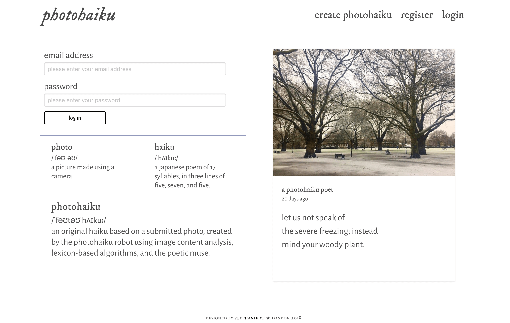
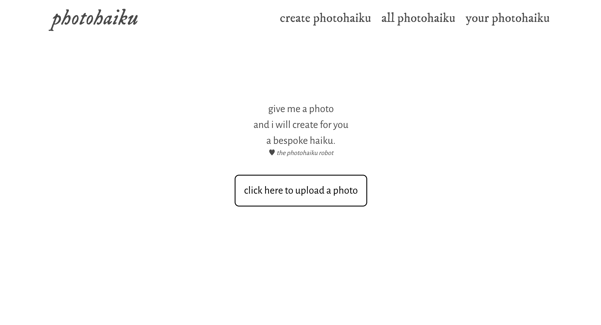
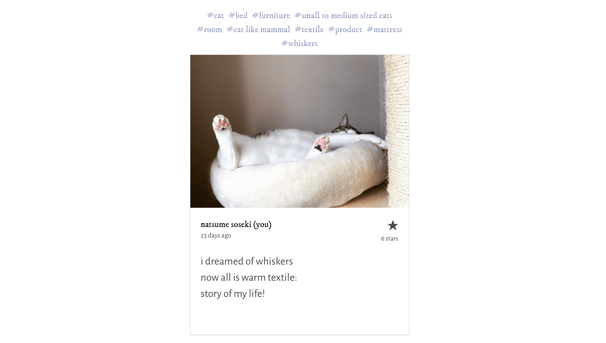
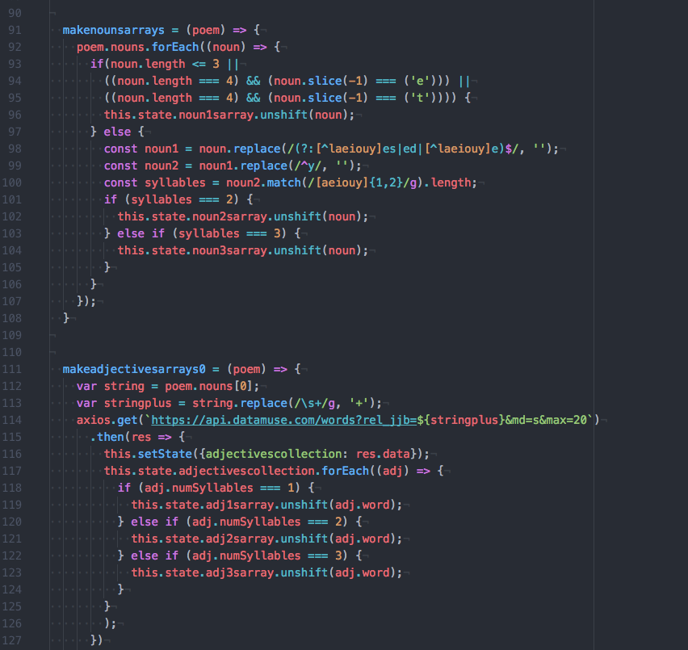
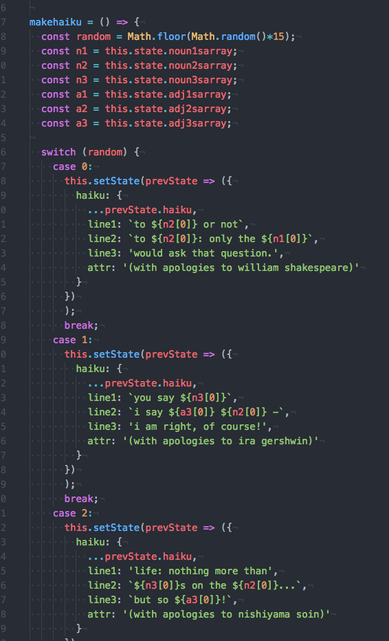
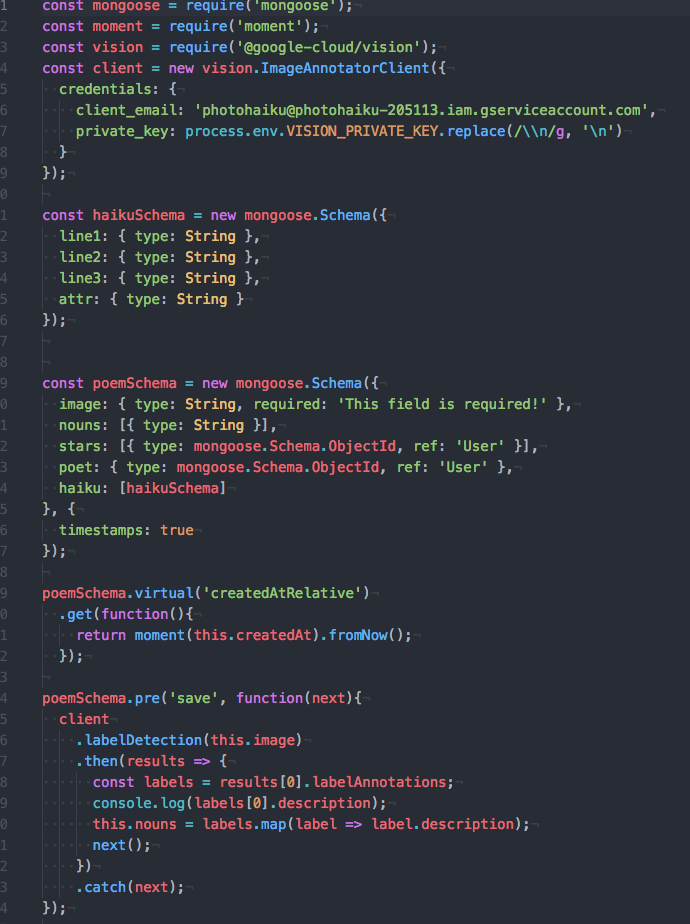
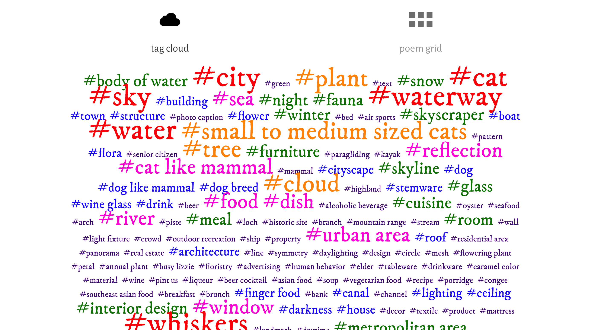
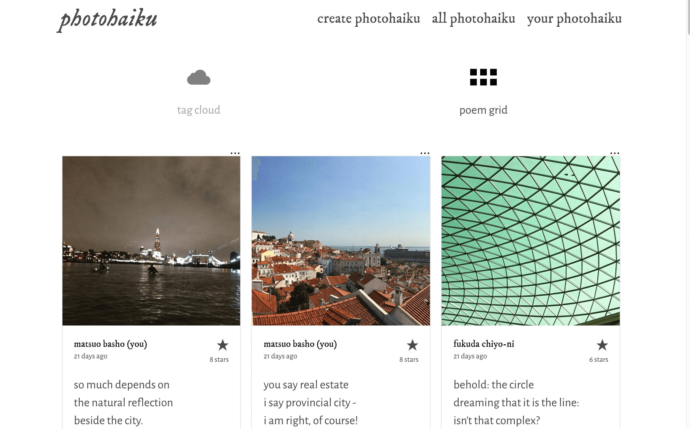

------------------
#PHOTOHAIKU
------------------

* [View app on Heroku](https://photohaiku.herokuapp.com/)
* [View repository on GitHub](https://github.com/stephslye/photohaiku)

For my first MERN stack app, I knew I wanted to
1. Work with an image content analysis API, as I am fascinated with that technology;
2. Write lots of sorting and filtering functions, as I find them satisfying; and
3. Create an app that creates a work of art.

The result is Photohaiku, an app that produces an original haiku (a three-line poem of five, seven and five syllables) based on a user-submitted photo. Users can create their own photohaiku, as well as browse, view and like (and unlike) other users’ submissions.

Besides the photo and haiku, the user also sees all the nouns returned by the image content analysis API, displayed as tags.

----------
##Approach
----------

This project uses the Filestack, Google Cloud Vision and Datamuse APIs:
* Filestack receives the photos, which can be uploaded from the Internet, from the device, from Facebook and Instagram, or taken with a webcam;
* Google Cloud Vision analyses the photos and produces an array of nouns associated with the image;
* Datamuse provides arrays of adjectives associated with the nouns.

To get syllable counts for the nouns, I used [this amazing formula posted on Stack Overflow](https://stackoverflow.com/questions/5686483/how-to-compute-number-of-syllables-in-a-word-in-javascript/8843915#8843915): it uses Regex to identify the presence of vowels in a word, which then suggests the number of syllables. However, the formula did not work perfectly for one-syllable words, so I tried to refine the process by writing my own function based on my observations about four-letter words.
As for the adjectives, the Datamuse API helpfully provided its own syllable counts.

I then plugged these words into my own haiku templates to produce the photohaiku:

I really enjoyed getting the three APIs to work together in one seamless (to the user) process, with the most challenging being the Google Cloud Vision API, as it had to be integrated into my model on the backend. It was also a real bother to hide the API key for deployment as it was a file rather than a string; in the end, my instructor at General Assembly helped me to extract the required data from the file and present it as strings:

However, overall it was surprisingly easy to manipulate the APIs, giving me more time to work on the website's presentation. As I like maps, I decided to create a tag cloud that reflects the frequency of nouns associated with the photohaiku. Users can click on a tag to see all photohaiku associated with that noun.

Otherwise, they can just view all photohaiku, displayed in a grid.

----------------------
##Room for improvement
----------------------
* Going forward, I’d love to improve the functionality for user accounts, for example enabling users to set their account to private and to friend and unfriend other users.

--------------
##Technologies
--------------
Languages:
* HTML5
* SCSS
* JavaScript

Front-end Web Application Framework:
* React

CSS Framework:
* Bulma

REST client
* Insomnia

APIs:
* [Filestack](https://www.filestack.com/)
* [Google Cloud Vision](https://cloud.google.com/vision/)
* [Datamuse](http://www.datamuse.com/)

Typefaces:
* [Google Fonts](http://fonts.google.com)

Text Editor:
* Atom

Browser:
* Chrome

---------
##Contact
---------

* hello@stephanieye.com
* http://stephanieye.com
